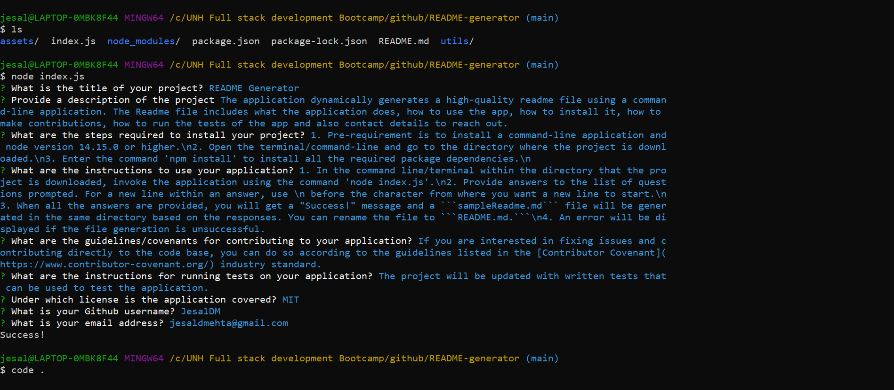

# README-generator
Professional README-generator  
[](https://opensource.org/licenses/MIT)

## User Story
```
AS A developer
I WANT a README generator
SO THAT I can quickly create a professional README for a new project
```
## Description
The application quickly and easily generates a high-quality readme file using a command-line application. The Readme file includes eveything that a high-quality README should contain. It has sections that details what the application does, how to use the app, how to install it, how to make contributions, how to run the tests of the app, license under which the project is covered along with the license badge and also includes contact details to reach out. There is also a Table of Contents to quickly get to each of the sections.

This ```sampleReadme.md``` file is generated dynamically from user's input using the [Inquirer package](https://www.npmjs.com/package/inquirer). 

## Table of Contents
* [Installation](#installation)
* [Usage](#usage)
* [Contributing](#contributing)
* [Questions](#questions)
* [License](#license)

## Installation
1. Pre-requirement is to install a command-line application and node version 14.15.0 or higher.
2. Open the terminal/command-line and open the directory where the project is downloaded. 
3. Enter the command 'npm install' to install all the required package dependencies.

## Usage
1. In the command line/terminal within the directory that the project is downloaded, invoke the application using the command 'node index.js' 
2. Provide answers to the list of questions prompted. For a new line within an answer, use \n before the character from where you want a new line to start.
3. When all the answers are provided, you will get a "Success!" message and a file named ```sampleReadme.md``` will be generated in the same directory based on the responses. You can copy the file to the destination folder and rename it to ```README.md```. 
4. An error will be displayed if the file generation is unsuccessful.

## Contributing
This application has been individually developed by Jesal Mehta. If you are interested in fixing issues and contributing directly to the code base, you can do so according to the guidelines listed in the [Contributor Covenant](https://www.contributor-covenant.org/) industry standard.

## Questions
For any questions,
Here is my Github profile link: [JesalDM](https://github.com/JesalDM)  
You can also reach out to me directly at [jesaldmehta@gmail.com](mailto:jesaldmehta@gmail.com)

## License
This project is licensed under the terms of the MIT license.

## For Review
* Github Repository URL: https://github.com/JesalDM/README-generator
* Walkthrough video: 
    - 
    - 
    - 
* Screenshot : 
* Link to sample Readme file: [Sample-Readme](./assets/sampleReadme.md)
